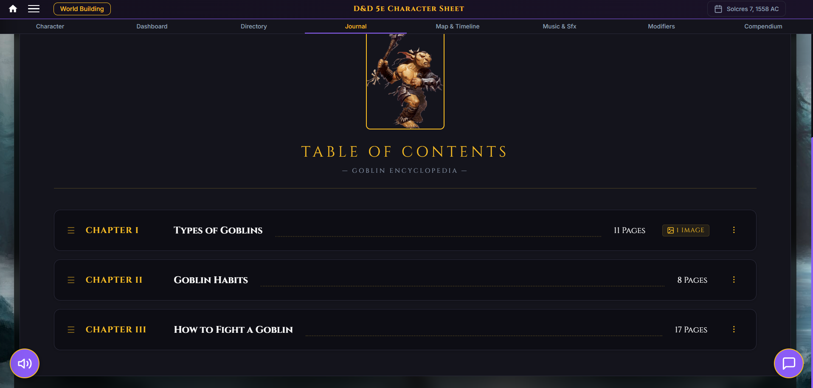
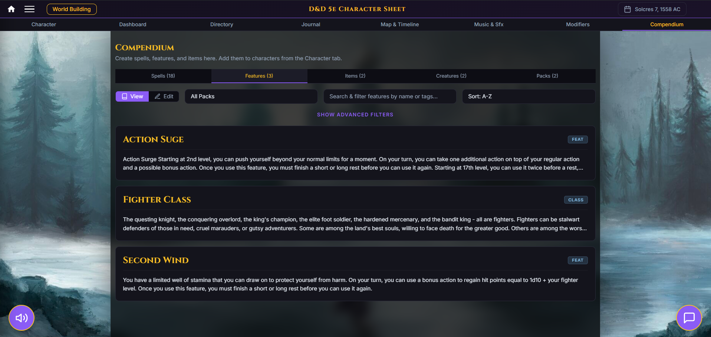

# Dungeon-Dive
Dungeon Dive is a comprehensive suite of Dungeon Master and Player tools made to create and run homebrew D&amp;D worlds and campaigns.

For now this repository will hold showcase images while it is being worked on. The following is a showcase of the Suite's tools and features. 

# Showcase

## Main Screen
In the main screen we have all of the characters with a character sheet. To help organize character sections can be added and characters can be moved under those sections. For DM purposes characters can be private and even hidden to prevent players from peeking at sheets. 

Characters can be owned by profiles created by the host, with each profile being owned by a player who logs in. These profiles can have various custom roles such as Co-DM.  

## Player and DM Tools
### Character Layout
The character layout is set up to help maximize the amount or relevant information seen at once and provides mechanical and visual customization to help fit the character. The character Portrait allows specific cropping to get just the right framing and includes quick swapping between images. Custom shared or private backgrounds and color themes are also included to help make the character sheet fit the character. Additionally this was specifically programmed without restrictions on stat score or even levels, with the allowance of custom proficiency bonuses beyond level 20.

On the lower half is everything needed for character combat such as a healthbar, skills, resources, and the main hotbar (attacks, spells, items).

Here is the spell layout which has filtering to provide an easy way to find spells.

### Currencies
Since currencies have always been difficult to track I have added in a currency calculator to make the calculations of buying and selling easier. To take it a step further I have added a currency exchanger as well; some compendiums hold a separate set of currencies at a separate purchasing power so this allows characters to easily transfer or exchange novel currencies.

### Sound Board and Roll Chat
To help enable story telling I added a Sound Board for all characters where each character owns their own sound and music. The DM does not need a character sheet though, when the access wordbuilding button they have their own set of assets as  if they had a character sheet.

#### Sound board
From the Sound Board people can upload, play, and even loop sounds and sound effects.

There is also a quick access sound board where players or the DM can put their favorite 9 sounds and music.

#### Roll Chat
I have also implemented chat rooms with a general roll chat. Here the players can text, upload images, send directory pages, and roll dice. Dice can be rolled in three modes, Public, Private (Only the DM and the player can see the roll), and Blind (Only the DM can see what the player rolled). 

### Journals
Players can create journals to log their adventures, or note down anything their hearts' desire. It allows the creation of chapters, adding of images, and sharing of pages into the chat.

Each page can be customized with markdown and can include a templated format for new pages.

### Personal Directory
This is the character directory, it can be used to pair images with quick notes. It allows for sections such as friend or enemy and categories such as people, places, and more.

### Combat Dashboard
Last but not least is the combat dashboard, which provides an easy and quick to use UI for players and DM. From here the DM can see every character's stats, add characters, compendium creatures, and even quick-create allies or enemies right on the spot. It has a reorderable initiative tracker and allows for the hiding or duplicating of creature cards.

### Azgaar's Fantasy Map Generator
Since it was free on github I decided to embed Azgaar's Fantasy Map Generator directly into the project meaning the Dungeon Master can create, edit, load, and save maps and the Players can view any public map the Dungeon Master shows. 

## Dungeon Master Tools
The Dungeon Master has their own set of personal tools that are only accessible by them and the appropriate roles if given permission.

### Compendium
The compendium is by and far the greatest asset to the DM. It allows for the creation of: Items, Features, Spells, Creatures, and Packs. 

When Creating Features there are systems for creating Classes and even a unique requirement system if you want to homebrew something special such as having to have a certain speed, or set of features to unlock a part of a feature or class; this also extends to items and requires an item be equipped. 

Compendium packs are a nice and easy way to include modules and other DLC style content. It allows for customizable spell ranks, currency, and rarities and allows the simple picking and choosing of what is included from the pack.

### Calendar
The Custom Calendar was a last minute add, but very much worth it! In it custom months and days of week can be added. Months are so customizable that they can even have a different name for and number of week days. There is also a system for leap days. However one of my favorite additions is the cycle and event system. This system allows for the adding of things such as lunar cycles and events such as holidays, birthdays, wars, and more. 

This is all of course accessible from the character sheet where players can set their character's birthday and see the global calendar.

There is also a secondary layout for a better look at all of the months.

I will continue to be adding features and play testing them to ensure that there are no errors. This has been the showcase, come back in a few months to see what else gets added!
